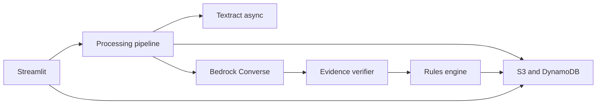
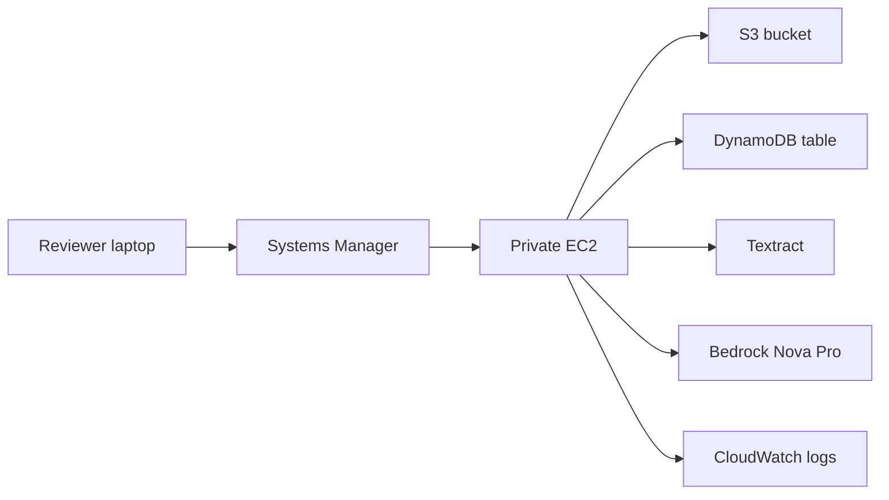

# Architecture

TransferLens is one Streamlit process. It reviews a full cash transfer from fictional NorthStar Trust into an already-open LPL Traditional IRA. The demo policy in `policy/northstar_demo_policy.json` is the comparison target. The answer key is used only by tests and scoring.

Local and replay runtimes keep JSON and uploaded bytes under `.local-data/`. Replay reads `fixtures/replay/` and does not call Textract or Bedrock. The `aws` runtime requires `TRANSFERLENS_BUCKET` and `TRANSFERLENS_TABLE`. On the instance, the AWS SDK uses the instance role. `AWS_PROFILE` is empty there.

Object keys are `cases/{case_id}/documents/{document_id}/{hash}.pdf`, `cases/{case_id}/runs/{run_id}/`, and `cases/{case_id}/packets/`. DynamoDB uses partition key `pk` and sort key `sk`, plus a `status-index` global secondary index. Full OCR JSON and PDFs stay in S3. Items point at those objects.

## Deployed shape

`TransferLensStack` in `infra/stack.py` is the only stack. It targets account `884025082158` and region `us-east-1`.

The instance is Amazon Linux 2023 in one public subnet, with an encrypted gp3 root volume and IMDSv2 hop limit 2 so the container can use the instance role. Its security group has outbound internet and no inbound rules. There is no public URL and no load balancer. A reviewer reaches port 8501 through Systems Manager port forwarding to `127.0.0.1` on the instance.

The instance role can use Systems Manager, the case bucket, the metadata table, Textract start and get, `bedrock:InvokeModel` for `us.amazon.nova-pro-v1:0`, and the 14-day log group. User data installs Docker and writes `/opt/transferlens/env` with resource names only. It starts `transferlens:local` when that image has been loaded. The image is not pulled from a public registry.

S3 blocks public access and uses SSE-S3. The bucket and table are retained if the stack is destroyed. The stack creates no NAT gateway and no VPC interface endpoints.
